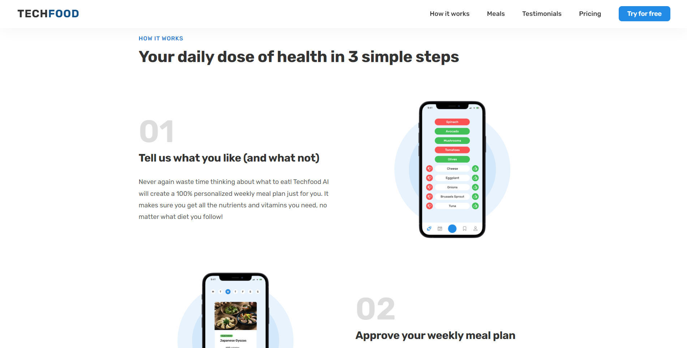

# Techfood

A well-designed website for ordering healthy food that is delivered directly to the customer's home.

## Tech Stack

- HTML
- CSS
- JavaScript

## Link website

https://techfood-alvon.netlify.app

| Hero                                 | How it works                                 |
| ------------------------------------ | -------------------------------------------- |
|  |  |

| Meals                                 | Testimonials                                 |
| ------------------------------------- | -------------------------------------------- |
|  |  |

| Pricing                                 | Try for free                                 |
| --------------------------------------- | -------------------------------------------- |
|  |  |

## Installation

Clone and move to the repository

```bash
git clone https://github.com/AlvonJ/techfood-alvon
cd techfood-alvon
```

Open index.html
